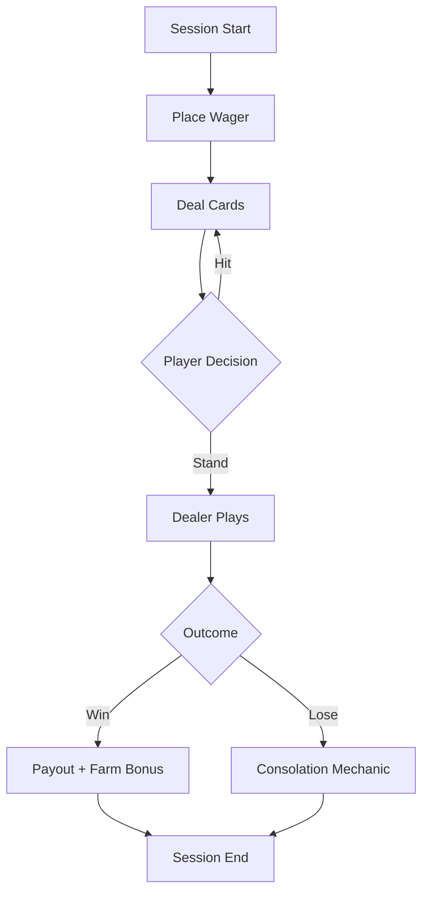

# Game Systems Documentation

Create professional AAA-quality game design documents with consistent structure, cross-referencing, and implementation-ready specifications.

## Document Hierarchy

| Document Type | Purpose | Typical Length |
|--------------|---------|----------------|
| Creative Brief | Vision, pillars, target audience | 2-5 pages |
| GDD (Game Design Document) | Complete game specification | 20-100+ pages |
| System Design Doc | Single system deep-dive | 5-20 pages |
| Feature Brief | Individual feature specification | 2-8 pages |
| Technical Design Doc | Implementation specifications | 10-30 pages |

## Required Sections by Document Type

### System Design Document (Minigames, Core Loops)

```
1. OVERVIEW
   - System Name & Codename
   - Design Pillars (3-5 guiding principles)
   - Player Fantasy (what experience this delivers)
   - Dependencies (other systems this touches)

2. CORE LOOP
   - Primary loop diagram (Mermaid or ASCII)
   - Session flow with timing
   - Win/loss states and triggers

3. MECHANICS SPECIFICATION
   - Input mechanics (player actions)
   - Processing mechanics (game calculations)
   - Output mechanics (feedback/rewards)
   - Edge cases and failure states

4. ECONOMY INTEGRATION
   - Currency inputs (what players spend)
   - Currency outputs (what players earn)
   - Sink/faucet balance
   - Cross-system influence maps

5. PROGRESSION
   - Unlock conditions
   - Difficulty scaling
   - Mastery indicators

6. UI/UX REQUIREMENTS
   - Screen inventory
   - Key interactions
   - Animation requirements
   - Audio cues

7. TECHNICAL NOTES
   - Data structures
   - State management
   - API endpoints needed
   - Performance considerations

8. METRICS & ANALYTICS
   - KPIs to track
   - A/B test opportunities
   - Balancing levers

9. APPENDICES
   - Probability tables
   - Payout matrices
   - Reference materials
```

### Feature Brief Template

```
FEATURE: [Name]
STATUS: [Concept | In Design | Ready for Dev | In Development]
OWNER: [Designer name]
VERSION: [X.X]

PROBLEM STATEMENT
What player need does this address?

SOLUTION OVERVIEW
High-level description (2-3 sentences)

SUCCESS CRITERIA
- Metric 1: [target]
- Metric 2: [target]

SCOPE
In Scope:
- Item 1
- Item 2

Out of Scope:
- Item 1

DEPENDENCIES
- System/Feature it requires
- System/Feature it affects

DETAILED SPECIFICATION
[Body of the feature design]

OPEN QUESTIONS
- [ ] Question 1
- [ ] Question 2
```

## Cross-Reference Standards

Use consistent ID formatting for traceability:

- Systems: `SYS-[ABBREV]-[NUM]` (e.g., `SYS-TULIP-001`)
- Features: `FEAT-[ABBREV]-[NUM]` (e.g., `FEAT-WAGER-012`)
- Mechanics: `MECH-[ABBREV]-[NUM]` (e.g., `MECH-CARD-003`)
- UI Screens: `UI-[ABBREV]-[NUM]` (e.g., `UI-HUD-007`)

Reference format in documents: `[See SYS-TULIP-001]` or `[Ref: FEAT-WAGER-012]`

## Diagram Standards

Use Mermaid for:
- Flow diagrams (game loops, player journeys)
- State machines (game states, UI states)
- Sequence diagrams (multiplayer interactions, API calls)
- Entity relationship diagrams (data models)

Example loop diagram:


## Probability & Payout Tables

Format all gambling mechanics with:

| Outcome | Probability | Payout | House Edge | RTP |
|---------|-------------|--------|------------|-----|
| [name]  | X.XX%       | X:1    | X.XX%      | XX% |

Always include:
- Theoretical RTP (Return to Player)
- House edge calculation
- Variance classification (Low/Medium/High)
- Hit frequency

## Writing Standards

- Use active voice and imperative mood
- Present tense for mechanics ("Player taps to confirm")
- Future tense for implementation notes ("System will validate...")
- Specific numbers over vague terms ("3 seconds" not "a few seconds")
- Define all jargon on first use

## Farming in Purria Conventions

Project-specific standards:

- Seasons: 42-day cycles, reference as `Day X of [Season]`
- Currency tiers: Petals (soft) → Seeds (premium) → Bulbs (ultra-rare)
- Simulin naming: `[Function]-[Generation]` (e.g., Harvester-Mk3)
- Card sessions: Always specify table (Tulip Hold'em, Hexfield Fortune, etc.)
- Influence mapping: Document card→farm effects with `INFLUENCE-[ID]`

## Quality Checklist

Before finalizing any document:

- [ ] All sections have content (no TBDs in shipped docs)
- [ ] Cross-references resolve to existing documents
- [ ] Numbers are specific and justified
- [ ] Diagrams render correctly
- [ ] Economy math is validated
- [ ] Edge cases are addressed
- [ ] Implementation notes are actionable
- [ ] Version number is updated

For detailed templates, see `references/templates.md`
